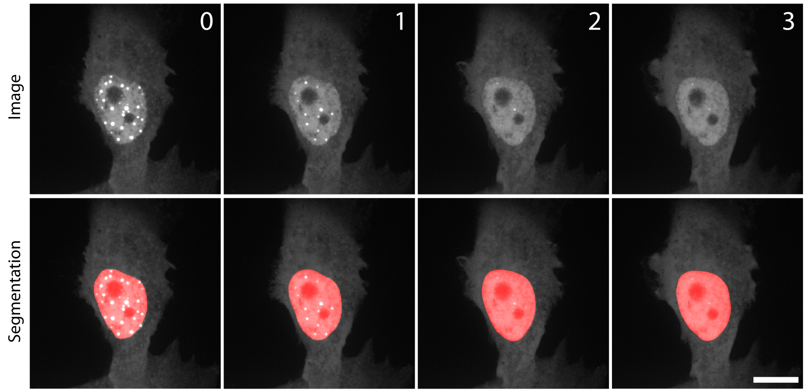
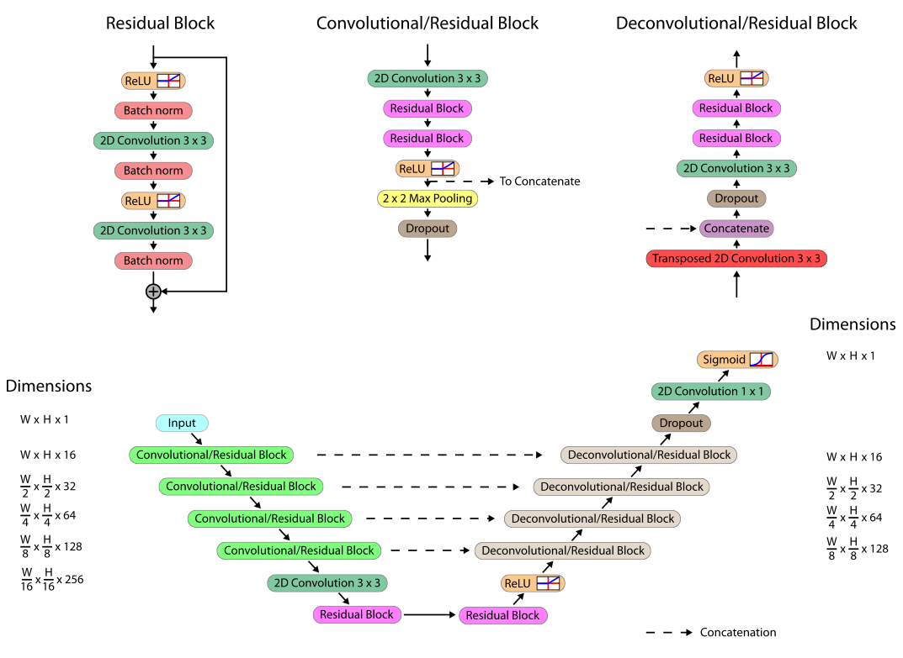

# nuclear_segmentation
<p align="center">
  
</p>
*Image: Watson et al., Nature 2023.

# Setup
First, clone the repo:
```
git clone https://github.com/deriverylab/nuclearsegmentation.git
```

### Setting up the conda environment and installing package

Ensure that you have either [Anaconda or Miniconda](https://conda.io/projects/conda/en/latest/user-guide/install/index.html) installed.

```
conda env create -f env/nuc_segment.yml
python setup.py install
pip install -e .
```
Anytime you run segmentation you should be sure to activate this conda environment by running
```
conda activate nuc_segment
```
Total setup should take less than 30 minutes on a standard desktop computer.
Note: Due to the variation in GPU types and drivers that users have access to, we are not able to make one environment that will run on all setups. As such, we are only providing a yml file with support for CUDA 11.1 and leaving it to each user to customize it to work on their setups. This customization will involve changing the cudatoolkit and (possibly) the tensorflow version specified in the yml file.


# Instructions for running segmentation
We provide as an example the pipeline to process a raw 3D (xyt) hyperstack. The hyperstack is in the format that our microscope outputs.

We first need to covert this 4D hyperstack into individual xy images. For this, we use imagej/Fiji. Simply open `imagej_macros/split_3dstack.ijm` in imagej and point it to the `examples` directory.

We now have a folder, `examples/Sequences/`, with individual xy images.

We can now run automated segmentation. In the nuclear_segment conda environment, run (ideally on a GPU):
```
conda activate nuc_segment
python predict.py --folder examples/Sequences/
```
<p align="center">
  
</p>

This will take a little while, but will output lots of images prefixed "outfile".
These can then be recompiled with another imagej macro

open `imagej_macros/recompile_sequences.ijm` and point it to `examples/Sequences/`

This will then generate outfile\*.tif files, which have the segmented nuclei.

## Post-processing
Often, there are several cells per image, and we therefore want to analyse them separately. There are also sometimes little pieces of wrongly-assigned nuclei. We therefore do some manual separation of the different nuclei. In imagej, we open the segmented files, and crop out each nucleus into a separate file.
 
